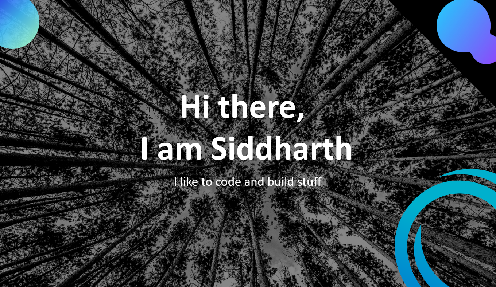

<h1 align="center">I'm a Programmer, a reader, and a chess enthusiast.   I like to explore new technologies, and build stuff from whatever tools I can get my hands on.</h1>

- 🔭 I’m currently working on React, Swift and React Native.
- 🌱 I’m currently learning Spring Boot.
- 📫 How to reach me: <a href="https://www.linkedin.com/in/siddharth-gautam-544b91181/"> LinkedIn</a>

<h3> 🛠 &nbsp;Tech Stack</h3>

-
   
  
  
   
- &nbsp;
  

